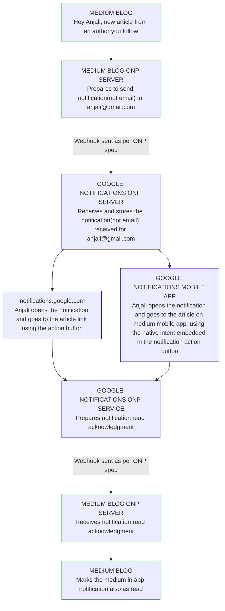

# Open notification protocol

> 💪 **Let's free email and communication channels from notifications. Webhooks for everybody!**

---

# Why a notification protocol?

😠 **Abuse of email and other communication channels for notifications.** 
Email is meant for communication, not to deliver notifications. Email overload is worsened by notifications piggybacking email.

😞 **Lack of interoperable notification delivery mechanism.**
There is no foolproof way for services to deliver notifications to a user, when the user is off their app/website/platform. Communication channels like email/SMS are abused as fallback.

🤩 **Make notifications useful again.** 
Potential to synchronise `on platform` and `off platform` notifications, reducing notification overload. Both users and notification publishers benefit from using a better channel optimised for notifications.

#### Examples of notifications overloading work email

| Service Category                       | Services                           |
| -------------------------------------- | ---------------------------------- |
| Workplace Collaboration Tools          | Microsoft Teams, Slack, Zoom       |
| Project Management Tools               | Asana, Trello, Jira                |
| Customer Relationship Management (CRM) | Salesforce, HubSpot                |
| Email Marketing Platforms              | Mailchimp, Constant Contact        |
| Issue Tracking and Helpdesk Systems    | Zendesk, Freshdesk                 |
| Human Resources Software               | BambooHR, Workday                  |
| Calendars and Scheduling Tools         | Google Calendar, Microsoft Outlook |

#### Examples of notifications overloading personal email

| Service Category               | Services                             |
| ------------------------------ | ------------------------------------ |
| Social Media Networks          | Facebook, Twitter, LinkedIn, YouTube |
| E-commerce and Shopping        | Amazon, eBay, Etsy                   |
| Online Banking                 | Banks, Financial Institutions        |
| Travel and Booking Services    | Airlines, Hotels, Travel Agencies    |
| News and Content Subscriptions | News Websites, Blogs                 |
| Fitness and Health Apps        | Fitbit, MyFitnessPal                 |
| Gaming Platforms               | Steam, Xbox Live                     |

---

# Notification v/s communication

Notification is also a form of communication. So how should one decide when to treat something as either communication or a notification?

> **If something is treated as notification on your app/website/platform, treat it as a notification off your platform as well. Don't offload it on to a communication channel.**

---

# A real life implementation example

---

# Architecture [WIP]
- User identification with email address

## Notification publishers
- Publishers send notifications as webhooks to `https://email-domain.com/onp-notifications/email-username`

## Notification subscribers
- Subscribers send read receipts as webhooks to `https://publisher-domain.com/onp-receipts/email-username`

## Notification spec
- Likely to follow Android notification spec
- Buttons with OS specific URIs

---
