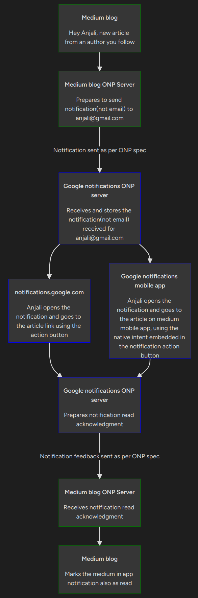

# Open notification protocol

💪 **Let's free email and communication channels from notifications, with interoperable notifications**

### Watch ONP video for a non technical explanation https://youtu.be/dnvcxz2KsgU

---
 
 
 

# Why a notification protocol?

😠 **Abuse of email and other communication channels for notifications.**
Email is meant for communication, not to deliver notifications. Email overload is worsened by notifications piggybacking email.

😞 **Lack of interoperable notification delivery mechanism.**
There is no foolproof way for services to deliver notifications to a user, when the user is off their app/website/platform. Communication channels like email/SMS are abused as fallback.

🤩 **Make notifications useful again.**
Synchronise `on platform` and `off platform` notifications, reducing notification overload. Both users and notification publishers benefit from using a better channel optimised for notifications.

#### Examples of notifications overloading work email

| Service Category                       | Services                           |
| -------------------------------------- | ---------------------------------- |
| Workplace Collaboration Tools          | Microsoft Teams, Slack, Zoom       |
| Project Management Tools               | Asana, Trello, Jira                |
| Customer Relationship Management (CRM) | Salesforce, HubSpot                |
| Email Marketing Platforms              | Mailchimp, Constant Contact        |
| Issue Tracking and Helpdesk Systems    | Zendesk, Freshdesk                 |
| Human Resources Software               | BambooHR, Workday                  |
| Calendars and Scheduling Tools         | Google Calendar, Microsoft Outlook |

#### Examples of notifications overloading personal email

| Service Category               | Services                             |
| ------------------------------ | ------------------------------------ |
| Social Media Networks          | Facebook, Twitter, LinkedIn, YouTube |
| E-commerce and Shopping        | Amazon, eBay, Etsy                   |
| Online Banking                 | Banks, Financial Institutions        |
| Travel and Booking Services    | Airlines, Hotels, Travel Agencies    |
| News and Content Subscriptions | News Websites, Blogs                 |
| Fitness and Health Apps        | Fitbit, MyFitnessPal                 |
| Gaming Platforms               | Steam, Xbox Live                     |

---
 
 
 

# Notification v/s communication

Notification is also a form of communication. So how should one decide when to treat something as either communication or a notification?

> **If something is treated as notification on your app/website/platform, treat it as a notification off your platform as well. Don't offload it on to a communication channel.**

---
 
 
 

# A real life notification delivery example

---
 
 
 

# A real life user on boarding example

1. Anjali signs up on Medium
2. During on boarding/sign up, Medium asks Anjali to choose a notification delivery channel. The options could be
	1. Piggyback my email
	2. Google notifications(let's assume Anjali's email provider is Google and Google has implemented ONP)
		1. This option cannot be shown if Google has not implemented ONP
	3. Enter `notification address`

#### 1.1 Anjali selects Google notifications
1. Since the email provider, Google, has implemented ONP, the `notification address` is set equal to the email address.
2. A test notification(could be packaged as a welcome notification) is sent to the notification address, by Medium. The notification has a button that allows Anjali to confirm that she has seen the test notification. If the notification address works well, then Anjali should see this on her Google notifications app/web app etc.
	1. Why this test notification?
		1. To educate Anjali about the new concept of dedicated notification channel
		2. To ensure that the email provider has indeed implemented ONP and notifications can be positively delivered
3. If the notification was successfully received, then Anjali sees the the notification and clicks the confirmation button.
4. Medium on boarding flow continues. Medium sends `off platform` notifications to Anjali via Google notifications, instead of email. These `off platform` notifications will work in tandem with Medium `on platform` notifications(in app, website) to prevent duplicate notifications for Anjali.

#### Anjali selects `Enter notification address`
1. Anjali has to input her `notification address`.
2. If she has already registered with a notification service provider (notification receiving part of ONP), then she should have her `notification address` set up. She can input that.
3. A test notification and OTP flow like above has to be completed.
4. If not, then she has to create a `notification address`,  by registering with a notification service provider of her choice and complete the process.

---
 
 
 

# Architecture [WIP]

- User identification with `notification address`
- If email provider has implemented ONP, set `notification address` = `email address` for best user experience.

## Notification publishers

To create or update notifications, notification publishers call the receiver's domain at https://onp.receiver-domain.com. Domain will be deduced from the notification address of the receiver(user).

| Field             | Description                                                                                                                                                                                                                         | Default value assumed    | Cached? | Can be updated |
| ----------------- | ----------------------------------------------------------------------------------------------------------------------------------------------------------------------------------------------------------------------------------- | ------------------------ | ------- | -------------- |
| Notification UUID | Unique identifier for the notification                                                                                                                                                                                              | -                        | No      | No             |
| Sender            | notification address of the sender                                                                                                                                                                                                  | -                        | -       | No             |
| Receiver          | notification address of the receiver                                                                                                                                                                                                | -                        |         | No             |
| Read status       | To signify the read/unread status of the notification                                                                                                                                                                               | unread                   | -       | Yes            |
| Update type       | `create` when the notification is created for the first time,   `update` when the notification has to be updated,   `delete` when the notification has to be deleted                                                                                                               | create                   | -       | Yes            |
| Title             | Notification title                                                                                                                                                                                                                  | -                        | -       | Yes            |
| Message           | Notification message                                                                                                                                                                                                                | -                        | -       | Yes            |
| Small icon URI    | URI or filename of image for small icon (status bar), monochrome                                                                                                                                                                    | cached value, if present | Yes     | Yes            |
| Large icon URI    | URI or filename of image for large icon, may not show if a picture is used, default is none                                                                                                                                         | cached value, if present | Yes     | Yes            |
| Accent color      | Accent colour for the notification, system may adjust, default is system default                                                                                                                                                    | system default           | Yes     | Yes            |
| Picture URI       | URI or filename of image for "big picture style" notification, may hide large icon, default is none                                                                                                                                 | none                     | Yes     | Yes            |
| Person URI        | Contact, mailto:, tel: or name: URI of person relevant to this notification.                                                                                                                                                        | -                        | No      | Yes            |
| Confidential      | Whether to only show the notification on secure screens                                                                                                                                                                             | no                       | -       | Yes            |
| Category          | Notification category                                                                                                                                                                                                               | -                        | -       | Yes            |
| Created at        | Unix timestamp when the notification was created                                                                                                                                                                                    | -                        | -       | No             |
| Updated at        | Unix timestamp when the notification was last updated                                                                                                                                                                               | -                        | -       | Yes            |
| Importance        | To determine the priority with respect to other notifications user receives                                                                                                                                                         | Low                      | -       | Yes            |
| Action buttons    | Array of action buttons. Each button is `primary`, `secondary` or `tertiary`. Buttons must have default URI and optionally platform specific URIs. A click on any action button should trigger a `read` feedback to the subscriber. | Low                      | -       | Yes            |

## Notification receiver
Notification receivers can provide feedback to the publisher about a notification, based on user actions, by calling the publisher's domain at `https://onp.publisher-domain.com`. Domain will be deduced from the `notification address` of the sender(publisher).

| Field                 | Description                                           |
| --------------------- | ----------------------------------------------------- |
| Notification UUID     | Unique identifier for the notification                |
| Read status           | To signify the read/unread status of the notification |
| Action button clicked | Details of the action button clicked                  |

Based on the feedback, if the notification needs to updated, the subscriber can respond with updated notification parameters.

## Peripheral APIs
### ONP support check API

### User notification address check API

---

